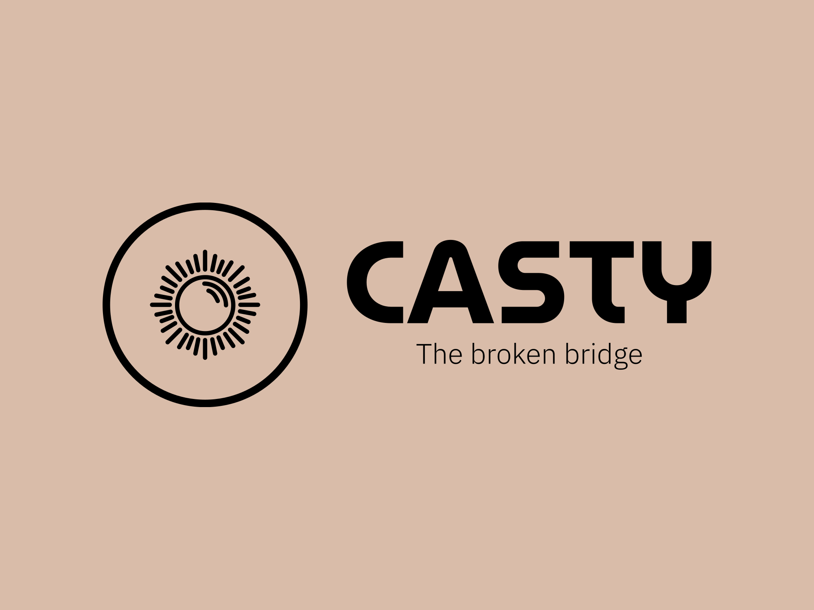

# Casty
Casty is an innovative app designed to revolutionize the casting process by bringing casting directors and models closer than ever before. Our platform offers a seamless and efficient way for casting directors to connect with talented models, simplifying the entire casting workflow.


## Installation

1. Clone the repository:
   ```shell
   git clone https://github.com/mohamedgamalmoha/Casty.git
   ```
2. Install virtual environment package - outside project directory -, then activate it:
    ```shell
    pip install virtualenv
    virtualenv env 
    source env/bin/activate (Linux/Mac)
    env\Scripts\activate (Windows)
    ```
3. Navigate to project directory, then install the requirements of the project by running:
    ```shell
    cd src
    pip install -r requirements.txt
    ```
4. Run redis server:
    ```shell
    redis-server --port 6380 --slaveof 127.0.0.1 6379
    ```
5. Run celery worker - don't forget to activate the virtualenv -:
    ```shell
    python -m celery -A core worker
    ```
4. Run django server, then got the local [url](http://127.0.0.1:8000/):
    ```shell
    python manage.pu runserver 
    ```
